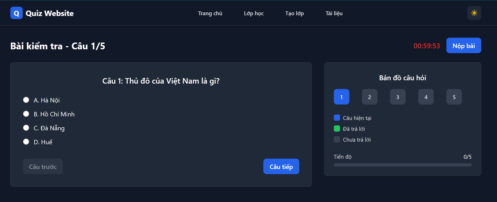

# Quiz Website (FE + BE)

<div align="center">
  <a href="https://liemdai.io.vn" target="_blank">
    <!-- Keep wallpaper -->
    
  </a>
</div>

---

# English

## Demo
- https://liemdai.io.vn/

## 1. UI Overview
A modern quiz website with full Dark/Light mode and responsive design. Navigation: Home, Classes, Create, Documents. Smooth animations, quiz minimap, and optional background music.

- FE stack: React 18, TypeScript, React Router, TailwindCSS
- Token storage: LocalStorage
- API base: `REACT_APP_API_BASE_URL` (dev default: `http://localhost:4000/api`)

## 2. Core Features
- Class management (create/update/delete, public, share)
- Quiz management (create/update/delete, publish)
- Question types: `single`, `multiple`, `text`, `drag`, `composite` (nested sub-questions)
- Take quizzes and scoring (Quiz Sessions)
- Image upload/delete for questions & options (multer + static)
- Documents management (docs/json/txt)
- Public & Share with access control:
  - `PublicItem` marks class/quiz as public
  - `ShareItem` generates share codes
  - `SharedAccess` stores user access: `full` | `navigationOnly`
- Forgot password via OTP (SMTP)

## 3. Business Logic
### 3.1. Classes
- Create: POST `/api/classes`
- Update: PUT `/api/classes/:id` (sync `PublicItem` when `isPublic` changes)
- Delete: DELETE `/api/classes/:id`
- List:
  - Mine: GET `/api/classes?mine=true` (owned + shared)
  - Public: GET `/api/classes` (merge from `PublicItem` and legacy `isPublic`)

### 3.2. Quizzes
- Create: POST `/api/quizzes`
  - Save `questions` with `type`, `options`, `correctAnswers`, `questionImage`, `optionImages`
  - If `composite`, create child questions via `parentId`
- Update: PUT `/api/quizzes/:id` (replace questions; sync `PublicItem` on `published`)
- Delete: DELETE `/api/quizzes/:id` (cleanup images)
- Get one: GET `/api/quizzes/:id` (supports `shortId`; access: owner | public | shared | class shared full)
- By class: GET `/api/quizzes/by-class/:classId` (filters by access and `accessLevel`)

### 3.3. Public & Share
- Public toggle: POST `/api/visibility/public` (targetType: `class|quiz`)
- Share toggle: POST `/api/visibility/share`
- Share status: GET `/api/visibility/share/status?targetType=...&targetId=...`
- Claim by code/id: POST `/api/visibility/claim`
- Remove access: DELETE `/api/visibility/access`
- List shared: `/api/visibility/shared/classes`, `/api/visibility/shared/quizzes`

### 3.4. Sessions
- Start: POST `/api/sessions/start`
- Submit: POST `/api/sessions/submit`
- By quiz: GET `/api/sessions/by-quiz/:quizId`
- Detail: GET `/api/sessions/:id`

### 3.5. Images & Files
- Upload image: POST `/api/images/upload` (FormData)
- Delete image: DELETE `/api/images/:filename`
- Files CRUD: `/api/files`
- Static: `/api/uploads/...` (prod can also map `/uploads`)

### 3.6. Auth & OTP
- Signup: POST `/api/auth/signup`
- Login: POST `/api/auth/login` (JWT HS256, header `Authorization: Bearer ...`)
- Me: GET `/api/auth/me`
- Forgot password:
  - Dev token: `/api/auth/forgot` → `/api/auth/reset`
  - OTP: `/api/auth/forgot-otp` → `/api/auth/reset-with-otp`

## 4. Backend Overview (quiz-backend)
- Express 5, Prisma 6, PostgreSQL
- Models: `User`, `Class`, `Quiz`, `Question`, `QuizSession`, `UploadedFile`, `PublicItem`, `ShareItem`, `SharedAccess`, `PasswordReset`
- Enums:
  - `QuestionType`: `single | multiple | text | drag | composite`
  - `FileType`: `docs | json | txt`
  - `TargetType`: `class | quiz`
  - `AccessLevel`: `full | navigationOnly`
- Routers (mounted under BASE_PATH, default `/api`): `/auth`, `/classes`, `/quizzes`, `/sessions`, `/files`, `/images`, `/visibility`
- Health: `GET {BASE_PATH}/health`

## 5. Development
```bash
# Backend
cd quiz-backend
npm install
npm run prisma:deploy
npm run prisma:generate
npm run dev   # default port 4000, BASE_PATH=/api

# Frontend (repo root)
npm install
# .env: REACT_APP_API_BASE_URL=http://localhost:4000/api
npm start
```

## 6. Deployment (cPanel)
- Node.js App:
  - Application root: folder containing `index.js` (e.g., `public_html/api`)
  - Application URL: `https://liemdai.io.vn/api`
  - Startup file: `index.js`
- ENV sample:
```
NODE_ENV=production
JWT_SECRET=... (required)
CORS_ORIGIN=https://liemdai.io.vn,https://www.liemdai.io.vn
# Depending on cPanel mapping:
# 1) If cPanel already maps /api to app root: leave BASE_PATH empty ("")
# 2) If keeping BASE_PATH=/api: you can mount both root and /api in code, or map app at site root
DATABASE_URL=prisma+postgres://accelerate.prisma-data.net/?api_key=...
SMTP_*=...
```
- Verify: `https://liemdai.io.vn/api/health`
- Note: after schema changes (e.g., add `drag`, `composite`), run `prisma:deploy` and restart

## 7. Frontend Production Config
- `.env`:
```
REACT_APP_API_BASE_URL=https://liemdai.io.vn/api
```
- Build: `npm run build`

## 8. Notes
- JWT token is stored in LocalStorage (Header fetches `/auth/me` to display name)
- CORS: include both with/without `www` if in use
- Images are stored under `quiz-backend/public/uploads` (prod may map under `public_html/uploads`)

---

# Tiếng Việt

## Demo
- https://liemdai.io.vn/

## 1. Giới thiệu giao diện
Website quiz với giao diện hiện đại, hỗ trợ Dark/Light mode, responsive đầy đủ. Thanh điều hướng gồm: Trang chủ, Lớp học, Tạo lớp, Tài liệu. UI có hiệu ứng chuyển động mượt, mini-map khi làm bài, trình phát nhạc nền tùy chọn.

- Công nghệ FE: React 18, TypeScript, React Router, TailwindCSS
- Lưu token: LocalStorage
- Config API: `REACT_APP_API_BASE_URL` (mặc định dev: `http://localhost:4000/api`)

## 2. Tính năng chính
- Quản lý lớp học (tạo/sửa/xóa, public, chia sẻ)
- Quản lý bài kiểm tra (tạo/sửa/xóa, xuất bản/publish)
- Loại câu hỏi: `single`, `multiple`, `text`, `drag`, `composite` (câu tổng hợp có sub-questions)
- Làm bài và chấm điểm (Quiz Sessions)
- Upload/Xóa ảnh cho câu hỏi & lựa chọn (multer + static serving)
- Quản lý tệp tài liệu (docs/json/txt)
- Công khai (Public) và Chia sẻ (Share) với phân quyền:
  - Bảng `PublicItem` đánh dấu class/quiz công khai
  - Bảng `ShareItem` sinh mã chia sẻ
  - Bảng `SharedAccess` lưu quyền truy cập của user: `full` | `navigationOnly`
- Quên mật khẩu qua OTP (SMTP)

## 3. Luồng/Logic nghiệp vụ
### 3.1. Lớp học (Class)
- Tạo lớp: POST `/api/classes`
- Cập nhật lớp: PUT `/api/classes/:id` (có đồng bộ `PublicItem` khi đổi `isPublic`)
- Xóa lớp: DELETE `/api/classes/:id`
- Danh sách lớp:
  - Mine: GET `/api/classes?mine=true` (bao gồm lớp sở hữu và lớp được share)
  - Public: GET `/api/classes` (ghép từ `PublicItem` và cờ legacy `isPublic`)

### 3.2. Bài kiểm tra (Quiz)
- Tạo quiz: POST `/api/quizzes`
  - Lưu `questions` kèm `type`, `options`, `correctAnswers`, `questionImage`, `optionImages`
  - Nếu `composite`, tạo các câu con (subQuestions) liên kết bằng `parentId`
- Sửa quiz: PUT `/api/quizzes/:id`
  - Cho phép thay thế toàn bộ câu hỏi, đồng bộ `PublicItem` khi đổi `published`
- Xóa quiz: DELETE `/api/quizzes/:id` (dọn ảnh đi kèm)
- Lấy quiz: GET `/api/quizzes/:id`
  - Hỗ trợ truy cập bằng `shortId` (utils/share)
  - Kiểm tra quyền: owner, public (quiz/class), share trực tiếp, hoặc share class `full`
- Danh sách quiz theo lớp: GET `/api/quizzes/by-class/:classId`
  - Lọc theo quyền: owner | public | shared (với `accessLevel`)

### 3.3. Công khai & Chia sẻ
- Public toggle: POST `/api/visibility/public` (targetType: `class|quiz`)
- Share toggle: POST `/api/visibility/share`
- Trạng thái share: GET `/api/visibility/share/status?targetType=...&targetId=...`
- Claim quyền theo code/id: POST `/api/visibility/claim`
- Gỡ quyền: DELETE `/api/visibility/access`
- Liệt kê mục được chia sẻ: `/api/visibility/shared/classes`, `/api/visibility/shared/quizzes`

### 3.4. Phiên làm bài (Sessions)
- Bắt đầu: POST `/api/sessions/start`
- Nộp bài: POST `/api/sessions/submit`
- Theo quiz: GET `/api/sessions/by-quiz/:quizId`
- Chi tiết: GET `/api/sessions/:id`

### 3.5. Ảnh & Tệp
- Upload ảnh: POST `/api/images/upload` (FormData)
- Xóa ảnh: DELETE `/api/images/:filename`
- Files: `/api/files` (list, upload docs/json/txt, delete)
- Static: `/api/uploads/...` (prod có thể map thêm `/uploads`)

### 3.6. Xác thực & OTP
- Đăng ký: POST `/api/auth/signup`
- Đăng nhập: POST `/api/auth/login` (JWT HS256, header `Authorization: Bearer ...`)
- Lấy user: GET `/api/auth/me`
- Quên mật khẩu:
  - Dev token: POST `/api/auth/forgot` → reset bằng `/api/auth/reset`
  - OTP qua email: `/api/auth/forgot-otp` → `/api/auth/reset-with-otp`

## 4. Cấu trúc Backend (quiz-backend)
- Express 5, Prisma 6, PostgreSQL
- Prisma schema có các model: `User`, `Class`, `Quiz`, `Question`, `QuizSession`, `UploadedFile`, `PublicItem`, `ShareItem`, `SharedAccess`, `PasswordReset`
- Enum:
  - `QuestionType`: `single | multiple | text | drag | composite`
  - `FileType`: `docs | json | txt`
  - `TargetType`: `class | quiz`
  - `AccessLevel`: `full | navigationOnly`
- Router chính (đều mount dưới BASE_PATH, mặc định `/api`):
  - `/auth`, `/classes`, `/quizzes`, `/sessions`, `/files`, `/images`, `/visibility`
- Health check: `GET {BASE_PATH}/health`

## 5. Chạy Dev
```bash
# Backend
cd quiz-backend
npm install
npm run prisma:deploy   # áp dụng migrations
npm run prisma:generate # generate Prisma Client
npm run dev             # port mặc định 4000, BASE_PATH=/api

# Frontend (thư mục gốc)
npm install
# .env DEV: REACT_APP_API_BASE_URL=http://localhost:4000/api
npm start
```

## 6. Triển khai (cPanel)
- Node.js App:
  - Application root: thư mục chứa `index.js` (ví dụ: `public_html/api`)
  - Application URL: `https://liemdai.io.vn/api`
  - Startup file: `index.js`
- ENV gợi ý (sửa theo thực tế):
```
NODE_ENV=production
JWT_SECRET=... (bắt buộc)
CORS_ORIGIN=https://liemdai.io.vn,https://www.liemdai.io.vn
# Tùy cách map của cPanel:
# 1) Nếu cPanel đã map URL /api vào app gốc: để BASE_PATH trống ("")
# 2) Nếu muốn giữ BASE_PATH=/api: có thể mount cả root và /api trong code, hoặc cấu hình URL app là gốc site
DATABASE_URL=prisma+postgres://accelerate.prisma-data.net/?api_key=...
SMTP_*=...
```
- Kiểm tra: `https://liemdai.io.vn/api/health` trả JSON
- Lưu ý: sau khi đổi schema (enum `drag`, `composite`), cần `prisma:deploy` và restart app

## 7. Cấu hình FE Production
- `.env` FE:
```
REACT_APP_API_BASE_URL=https://liemdai.io.vn/api
```
- Build: `npm run build` → deploy static (tuỳ hosting)

## 8. Ghi chú
- Token JWT lưu ở LocalStorage (Header sẽ gọi `/auth/me` để lấy tên hiển thị)
- CORS: thêm cả domain có/không `www` nếu sử dụng
- Ảnh lưu tại `quiz-backend/public/uploads` (prod có thể đặt dưới `public_html/uploads` tùy map)

---

© LiemDai Website. For support, please open an issue or contact the repo owner.
