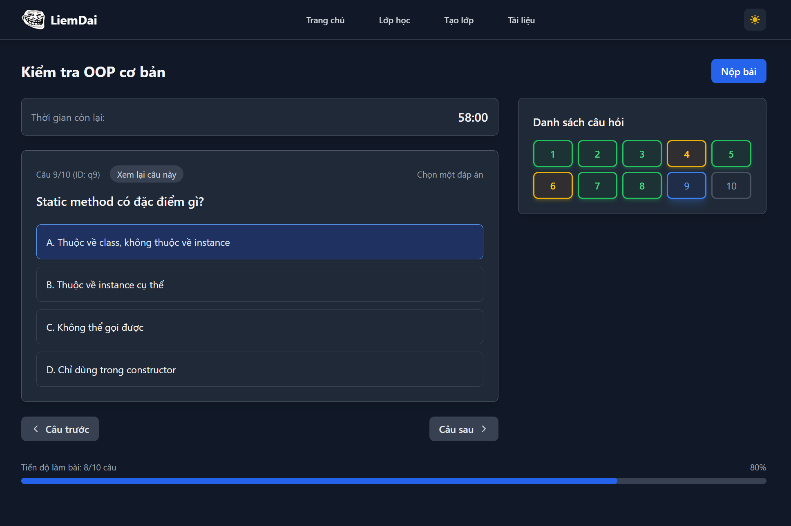

# Quiz Website - Front-End

<div align="center">
  <a href="https://hoanbucon.id.vn" target="_blank">
    
  </a>
</div>

<hr />

## Project Description

Quiz Website is a web application built with ReactJS and Tailwind CSS, providing a platform for creating and taking online multiple-choice quizzes. The website features a modern user interface, supports dark/light mode, and responsive design.

## Key Features

### 🏠 Home Page
- Displays a list of public classrooms
- Quick website statistics
- User-friendly interface

### 📚 Classrooms
- Manage user's own classrooms
- View list of quizzes in each class
- Track learning progress and performance

### ➕ Create Class
- Upload document files (.doc, .docx, .json, .txt)
- Drag-and-drop file upload support
- Automatically process files to generate quiz questions

### 📖 Take Quiz
- Quiz interface with 3 types of questions:
  - Single correct answer
  - Multiple correct answers
  - Fill-in-the-blank
- Minimap showing quiz progress
- Countdown timer
- Navigation between questions

### 📁 Documents
- Manage uploaded document files
- Download documents
- Create classrooms from documents
- File size and quantity statistics

### 🌙 Dark/Light Mode
- Automatic theme switching
- Save theme state in localStorage
- Consistent UI across both modes

## Technologies Used

- **React 18** – JavaScript Framework
- **TypeScript** – Type-safe programming language
- **Tailwind CSS** – Utility-first CSS framework
- **React Router** – SPA routing
- **Context API** – State management

## Project Structure


```
src/
├── components/
│   └── Layout/
│       ├── Header.tsx
│       ├── Footer.tsx
│       └── Layout.tsx
├── context/
│   └── ThemeContext.tsx
├── pages/
│   ├── HomePage.tsx
│   ├── ClassesPage.tsx
│   ├── CreateClassPage.tsx
│   ├── DocumentsPage.tsx
│   └── QuizPage.tsx
├── types/
│   └── index.ts
├── App.tsx
└── index.css
```

## Installation and Running

### System Requirements
- Node.js (version 16 or higher)
- npm or yarn

### Installation

1. Clone the repository:
```bash
git clone https://github.com/HoanBuCon/Quiz-Website-FE.git
cd quiz-website
```

2. Install dependencies:
```bash
npm install
```

3. Run the project in development mode:
```bash
npm start
```

4. Open your browser and visit: `http://localhost:3000`

### Build for Production

```bash
npm run build
```

## Tailwind CSS Configuration

This project is pre-configured with Tailwind CSS including:
- Dark mode and Light mode support
- Custom color palette
- Responsive design
- Custom components

## Highlight Features

### 🎨 Modern UI
- Clean and professional design
- Responsive across all devices
- Smooth animations
- Loading states

### 🔄 State Management
- Context API for theme management
- Local state for components
- Persistent theme preference

### 📱 Responsive Design
- Mobile-first approach
- Breakpoints for tablet and desktop
- Touch-friendly interface

### ⚡ Performance
- Lazy loading components
- Optimized bundle size
- Efficient re-renders

## User Guide

### 1. Create a New Class
1. Go to the "Create Class" page
2. Upload a document file (.doc, .docx, .json, .txt)
3. The system will automatically process and generate questions

### 2. Take a Quiz
1. Go to the "Classrooms" page
2. Select a class to join
3. Click "Take Quiz" to start
4. Use the minimap to navigate between questions

### 3. Manage Documents
1. Go to the "Documents" page
2. Upload, download, or delete files
3. Create a class from existing documents

## Backend Integration

The project is designed for easy backend integration:
- API endpoints are pre-defined
- TypeScript interfaces for data models
- Error handling patterns
- Loading states for async operations

## Contributing

1. Fork the project
2. Create a feature branch (`git checkout -b feature/AmazingFeature`)
3. Commit changes (`git commit -m 'Add some AmazingFeature'`)
4. Push to branch (`git push origin feature/AmazingFeature`)
5. Create a Pull Request

## License

This project is licensed under the MIT License.

## Contact

- https://hoanbucon.id.vn/  
- For any questions or suggestions, please create an issue in the GitHub repository.

---

**Note**: This is the frontend version of the project. A separate backend API needs to be developed to fully enable all functionalities.
